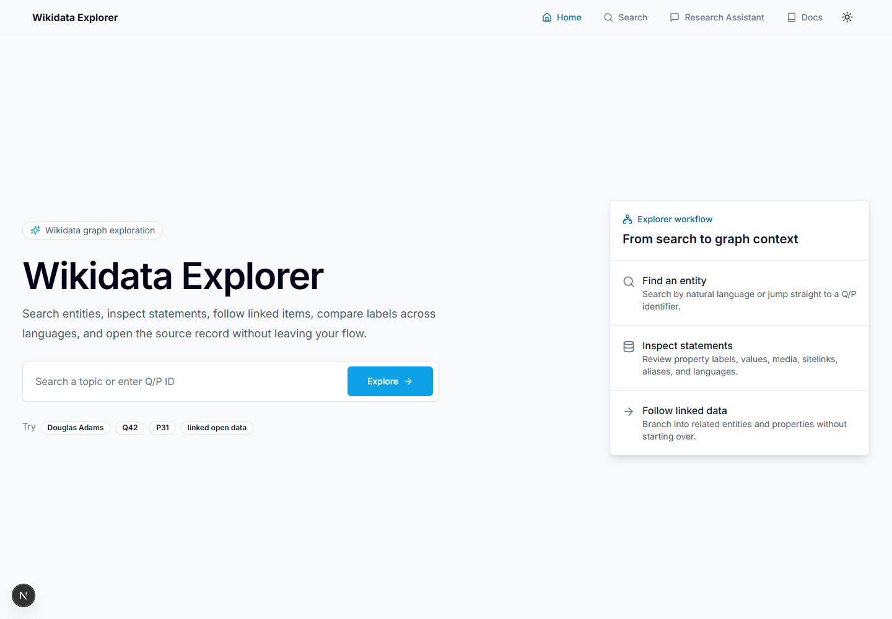
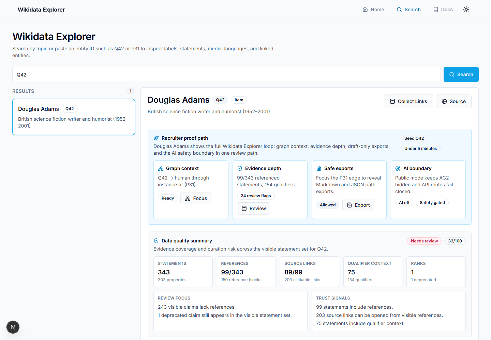
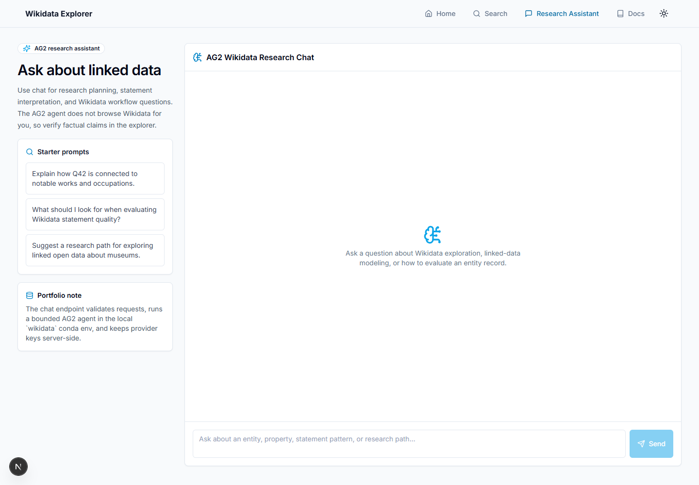
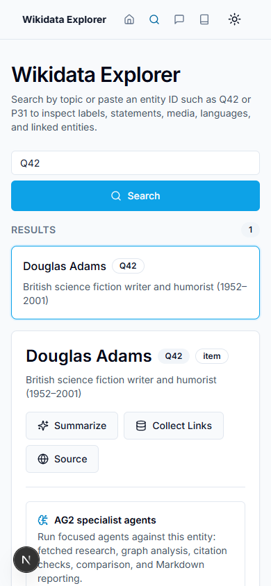

# 🌐 Wikidata Explorer

A portfolio-ready **Next.js 16** application for searching Wikidata, inspecting entity statements, visualizing relationships, and using an **AG2-backed** research assistant for linked-data workflows.

The project is built to show practical full-stack product judgment: real public APIs, normalized data modeling, interactive graph exploration, server-side AG2 agent orchestration, automated verification, visual QA, and CI.

## ✨ Highlights

- 🔎 Search Wikidata by keyword or direct entity/property ID such as `Q42` or `P31`
- 🧾 Inspect normalized labels, descriptions, aliases, statements, sitelinks, languages, and Commons media
- 🕸️ Explore a clickable relationship graph with rank, target-type, relationship, and evidence filters plus hover previews and selected-edge details
- 🧭 Follow related items and properties without restarting the search flow
- 🔗 Launch directly into a query with `/search?q=Douglas%20Adams`
- 🤖 Generate grounded AG2 outputs through specialist agents for research, graph analysis, selected-edge next-entity suggestions, citation verification, comparison, and Markdown reports
- 🧾 Inspect statement ranks, qualifiers, and references in expandable evidence rows
- 🗃️ Revisit saved AG2 agent runs per entity through browser-local workbench history
- 🧑‍⚖️ Review an entity-level data-quality summary plus a persisted local task queue for deprecated and unreferenced visible statements, including source-link coverage and extracted source hints when references exist
- 📤 Export review findings, task status, source hints, and clickable source-link context as safe QuickStatements draft comments and Markdown curation notes
- 🔁 Retry transient AG2/OpenAI bridge failures with bounded backoff while preserving validation/auth failures and failing fast when server-side keys are missing
- 🛡️ Classify specialist workflows through a tested autonomy safety layer before future bot/draft actions
- ✅ Verify changes with lint, unit tests, production build, clean production trace checks, route smoke tests, API contract tests, e2e interaction tests, visual QA, and GitHub Actions

## 🧰 Tech Stack

- **Next.js 16 App Router**
- **React 19 stable**
- **TypeScript**
- **Tailwind CSS**
- **Radix UI primitives** for tabs and slots
- **Wikidata Action API**, **Wikibase REST API**, and **Wikimedia Commons API**
- **AG2 / AutoGen** running through the local `wikidata` conda env for server-side agents
- **Playwright Core** with installed Chrome for local e2e and visual QA
- **GitHub Actions** for CI verification

## 🚀 Local Development

Prerequisites:

- Node.js 20 or newer
- npm

Install and launch:

```powershell
npm install
npm run dev -- --port 3000
```

Open [http://localhost:3000](http://localhost:3000).

## 🔐 Environment

Create `.env` from `.env.example` for local chat support:

```powershell
Copy-Item .env.example .env
```

Set `OPENAI_API_KEY` to a valid project key. `OPENAI_MODEL` is optional and defaults to `gpt-4o-mini`. AG2 runs through `AG2_CONDA_ENV=wikidata` by default; set `AG2_PYTHON` to a Python executable if you want to bypass conda discovery. Transient bridge/provider failures retry with bounded backoff through `AG2_AGENT_MAX_ATTEMPTS`, `AG2_AGENT_RETRY_BASE_MS`, and `AG2_AGENT_RETRY_MAX_MS`.

Local environment files, Pywikibot credentials, runtime files, caches, and research artifacts are ignored by default.

## 🧪 Useful Commands

```powershell
npm run lint
npm run test
npm run build
npm run verify
npm run smoke
npm run e2e
npm run visual:qa
```

`npm run smoke`, `npm run api:contracts`, `npm run e2e`, and `npm run visual:qa` expect the app to be running locally. `npm run trace:check` expects a completed `npm run build` and asserts API route traces keep the AG2 bridge while excluding repo clutter and local bot files. `npm run e2e` clicks through the `Q42` relationship graph, and `npm run visual:qa` captures portfolio screenshots while checking for horizontal overflow. Curation export tests assert QuickStatements drafts remain comment-only until a human adds sources and approval, while source-hint tests keep reference URL, stated-in Wikidata links, retrieved-date, and formatter-aware external-ID summaries stable.

Override local targets when needed:

```powershell
$env:SMOKE_BASE_URL = "http://localhost:3000"
$env:API_CONTRACT_BASE_URL = "http://localhost:3000"
$env:E2E_BASE_URL = "http://localhost:3000"
$env:VISUAL_QA_BASE_URL = "http://localhost:3000"
npm run smoke
npm run e2e
npm run visual:qa
```

## 🖼️ Portfolio Screenshots

These screenshots are generated by `npm run visual:qa` and checked for horizontal overflow across desktop and mobile layouts.

| View | Screenshot | What it proves |
| --- | --- | --- |
| 🏠 Home |  | The first screen explains the product quickly and routes users into search. |
| 🕸️ Q42 graph |  | The main explorer loads Wikidata data, prefers stable English labels, and renders a clickable relationship graph. |
| 🤖 Research assistant |  | The AG2 chat surface is visually integrated with the Wikidata workflow. |
| 📱 Mobile search |  | The core explorer remains usable on a narrow viewport without horizontal overflow. |

## 🗂️ Project Structure

- `app/page.tsx`: first-screen search entry point
- `app/search/page.tsx`: main Wikidata explorer workflow, graph-focused AG2 runs, data-quality summary, saved agent runs, and persisted evidence review queue
- `app/chat/page.tsx`: AG2 research assistant
- `app/agents/page.tsx`: AG2 specialist agent workbench overview
- `app/api/chat/route.ts`: AG2-backed server-side chat endpoint
- `app/api/entity-summary/route.ts`: AG2-backed grounded entity summary endpoint
- `app/api/ag2-workflow/route.ts`: AG2 specialist workflow endpoint with autonomy safety gating for research, graph, suggestions, verification, comparison, and reports
- `components/relationship-graph.tsx`: clickable, filterable entity relationship visualization
- `lib/wikidata.ts`: Wikidata API client and normalization helpers
- `lib/wikidata-utils.mjs`: unit-tested Wikidata ID and sitelink utilities
- `lib/autonomy-safety.mjs`: tested autonomy policy for read-only, draft, and bot-risk actions
- `lib/curation-export.mjs`: safe QuickStatements draft and Markdown review export helpers
- `lib/review-source-hints.mjs`: tested source-hint extraction for reference URLs, stated-in records, retrieved dates, and formatter-aware external IDs
- `lib/data-quality.mjs`: tested entity evidence scoring, source-link coverage, and trust-signal summary helper
- `scripts/smoke-routes.mjs`: local route and API smoke checks
- `scripts/test-api-contracts.mjs`: live API validation, safety, and precondition contract checks
- `scripts/test-search-interaction.mjs`: browser interaction test for data-quality summary, graph filtering, traversal, and direct PID lookup
- `scripts/test-autonomy-safety.mjs`: autonomy safety policy tests
- `scripts/test-curation-export.mjs`: safe curation draft export tests
- `scripts/test-review-source-hints.mjs`: source-hint extraction and summary tests
- `scripts/test-ag2-reliability.mjs`: AG2 retry/backoff classification tests
- `agents/wikidata_ag2_agent.py`: bounded AG2 agent bridge for chat, research, graph analysis, next-entity suggestions, citation verification, comparison, and reports
- `lib/ag2.ts`: Next.js-to-AG2 process bridge with missing-key guard and bounded retry/backoff
- `lib/ag2-reliability.mjs`: tested AG2 retry classification and delay helpers
- `scripts/visual-qa.mjs`: portfolio screenshot and layout overflow checks
- `scripts/test-deployment-trace.mjs`: post-build trace check for deployable API route bundles
- `.github/workflows/ci.yml`: GitHub Actions verification, smoke, e2e, and visual QA
- `ROADMAP.md`: forward-looking product and engineering plan

## 🛡️ Verification Status

Run `npm run verify` before shipping code changes. Run `npm run smoke`, `npm run e2e`, and `npm run visual:qa` with the local dev server running to catch route, interaction, and layout regressions such as `/search?q=Q42` failures.

CI also runs install, verify, production trace checks, smoke, API contracts, e2e, visual QA, and screenshot artifact upload on GitHub Actions.

## 🗺️ Roadmap

See [ROADMAP.md](ROADMAP.md) for the recommended development path toward a stronger research tool, richer graph exploration, stronger AI context, and production deployment readiness.


