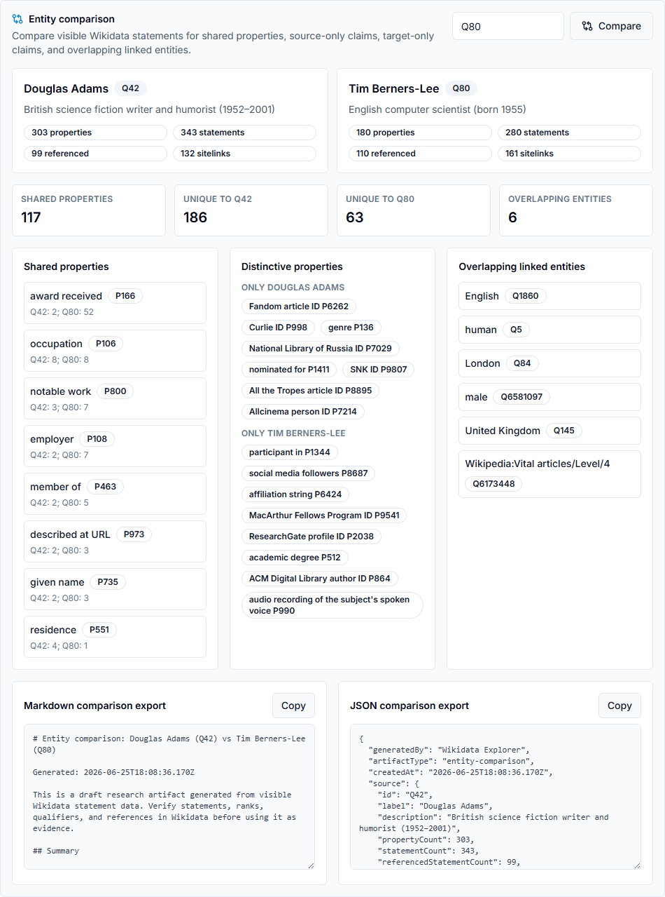

# 🌐 Wikidata Explorer

A portfolio-ready **Next.js 16** application for searching Wikidata, inspecting entity evidence, visualizing relationships, and optionally running **AG2-backed** linked-data research agents.

Live demo: [www.wikidataexplorer.com](https://www.wikidataexplorer.com)

[](https://www.wikidataexplorer.com)
[](https://github.com/sundog358/wikidata-explorer/actions/workflows/ci.yml)
[](https://github.com/sundog358/wikidata-explorer/actions/workflows/ci.yml)

Wikidata Explorer is the public product and domain: the app helps users assemble a trail of entities, statements, labels, references, and linked records into a trustworthy research picture.

The public demo ships safely on Vercel with AI disabled by default, while the AG2 agent runtime can be enabled locally or hosted as a separate container service.

## ✨ Highlights

- 🔎 Search Wikidata by keyword or direct entity/property ID such as `Q42` or `P31`
- 🧾 Inspect normalized labels, descriptions, aliases, statements, sitelinks, languages, and Commons media
- 🕸️ Explore a clickable relationship graph with URL-backed filters, depth controls, grouped-by-property and timeline evidence layouts, richer node previews, pinned relationship comparison, selected-edge statement details, and shareable selected-path Markdown/JSON export views
- ⚖️ Compare two or three entities without AI by shared properties, distinctive statements, property matrices, overlapping linked entities, shareable comparison URLs, and shareable Markdown/JSON/property-focused research export views
- 🧭 Follow related items and properties without restarting the search flow
- 🔗 Launch directly into a query with `/search?q=Douglas%20Adams`, a seeded Q42 proof path, or a shared comparison such as `/search?q=Q42&tab=compare&compare=Q80`
- 🧠 Keep AI behind explicit feature flags for a reliable public Vercel demo
- 🤖 Enable AG2 specialist agents for research, graph analysis, next-entity suggestions, citation verification, comparison, Markdown reports, selected workbench context handoff into chat, and route-validated citation-style grounding references
- 🐳 Run agents through local conda or a token-protected containerized FastAPI AG2 service
- 🧾 Inspect statement ranks, referenced/unreferenced badges, statement IDs, qualifiers, references, and source hints in expandable evidence rows
- 🗃️ Revisit saved AG2 agent runs per entity when AI mode is enabled
- 🧑‍⚖️ Review entity data-quality findings with persisted browser-local task status and source-link hints
- 💾 Save browser-local or token-protected project workspace slots with curation-task and agent-history summaries/previews plus Markdown project briefs, or export/restore portable snapshots with curation task details, review state, dismissed findings, and saved AG2 run history
- 📤 Export evidence-grounded graph paths, review findings, task status, source hints, and safe QuickStatements draft comments
- 🛡️ Classify specialist workflows through a tested autonomy safety layer before future bot/draft actions
- ✅ Verify changes with lint, unit tests, production build, trace checks, route smoke tests, API contracts, e2e interaction tests, visual QA, and GitHub Actions

## 🧭 Portfolio Case Study

Wikidata Explorer is built to answer a focused research question: how quickly can someone start from one Wikidata entity and understand the trustworthy graph around it?

Read the standalone case study: [docs/case-study.md](docs/case-study.md).

- **Product decision:** lead with a fast public Next.js explorer, then route reviewers into a seeded Q42 proof path that shows graph context, evidence depth, safe exports, and the AI boundary in one short review.
- **Data depth:** normalize Wikidata labels, statements, qualifiers, references, ranks, media, and language coverage into inspectable UI instead of flattening everything into generic search results.
- **AI boundary:** keep AG2 agents feature-flagged and server-side so the public demo remains reliable while the Python/container runtime can be enabled for richer research workflows with route-level grounding validation.
- **Trust story:** pair graph and curation exports with autonomy-safety gates, route/API contracts, a mocked remote AG2 service contract, browser e2e checks, visual QA screenshots, and deployment trace checks.

## 🧰 Tech Stack

- **Next.js 16 App Router**
- **React 19 stable**
- **TypeScript**
- **Tailwind CSS**
- **Radix UI primitives** for tabs and slots
- **Wikidata Action API**, **Wikibase REST API**, and **Wikimedia Commons API**
- **AG2 / AutoGen** through either the local `wikidata` conda env or `AG2_SERVICE_URL`
- **FastAPI + Docker** for the optional AG2 container runtime
- **Playwright Core** with installed Chrome for local e2e and visual QA
- **GitHub Actions** for CI verification

## 🚀 Local Development

Prerequisites:

- Node.js 20 or newer
- npm

Install and launch:

```powershell
npm install
npm run dev -- --port 3000
```

Open [http://localhost:3000](http://localhost:3000).

## 🔐 Environment

Create `.env` from `.env.example`:

```powershell
Copy-Item .env.example .env
```

Public/demo mode keeps AI disabled:

```powershell
NEXT_PUBLIC_ENABLE_AI_AGENTS=false
ENABLE_AI_AGENTS=false
```

Local conda-backed AI mode:

```powershell
NEXT_PUBLIC_ENABLE_AI_AGENTS=true
ENABLE_AI_AGENTS=true
OPENAI_API_KEY=sk-proj-...
AG2_CONDA_ENV=wikidata
```

Container-backed AI mode:

```powershell
NEXT_PUBLIC_ENABLE_AI_AGENTS=true
ENABLE_AI_AGENTS=true
AG2_SERVICE_URL=http://localhost:8000
AG2_SERVICE_TOKEN=generate-a-random-32-plus-character-secret
```

`OPENAI_MODEL` is optional and defaults to `gpt-4o-mini`. If `AG2_SERVICE_URL` is unset, the Next.js API routes run the Python bridge through `AG2_CONDA_ENV=wikidata` or `AG2_PYTHON`. If `AG2_SERVICE_URL` is set, the container service owns the provider credentials and Next.js calls `/run` on that service with `Authorization: Bearer $AG2_SERVICE_TOKEN`. The token must be present on both Vercel and the AG2 service host and must be at least 32 characters.

Optional hosted monitoring:

```powershell
API_OBSERVABILITY_WEBHOOK_URL=https://your-monitor.example.com/api/events
API_OBSERVABILITY_WEBHOOK_TOKEN=generate-a-random-shared-token
API_OBSERVABILITY_RECEIVER_TOKEN=generate-a-random-shared-token
API_OBSERVABILITY_STORE_DIR=/mnt/wikidata-observability
```

When configured, AI API routes post sanitized failure events plus matching alert-rule metadata to the webhook. The built-in `/api/observability/events` receiver can be used as the target when protected with `API_OBSERVABILITY_RECEIVER_TOKEN` or the shared webhook token; it exposes the evaluated dashboard snapshot behind the same bearer token. By default the receiver keeps a bounded in-memory event window; set `API_OBSERVABILITY_STORE_DIR` to a durable mounted directory to retain sanitized monitor events across restarts. HTTPS is required outside localhost, and prompts, raw payloads, provider keys, bearer tokens, and local store paths are not sent in monitor payloads or receiver responses.

Optional project-backed workspace storage:

```powershell
WORKSPACE_STORE_DIR=C:\path\to\durable\workspace-store
WORKSPACE_STORE_TOKEN=generate-a-random-shared-token
```

When configured, `/api/workspaces` provides bearer-token-protected project workspace slot persistence using the same sanitized portable snapshot format as browser-local slots. The Review Queue tab can load, save, and delete project slots with curation task details, review statuses, dismissed findings, saved AG2 run history, compact project task summaries, saved-agent-run summaries, top backlog/history previews, and a Markdown project brief for reviewer handoff when a private/self-hosted token is entered; the token is kept in browser session storage. Use `includeTasks=true` and `includeAgentRuns=true` on reads, or `includeTasks: true` and `includeAgentRuns: true` on writes/deletes, to include the sanitized project curation-task index, saved-agent-run index, and summaries in API responses. The route also accepts an optional `accountId`/`account` namespace for account-ready hosted storage experiments while preserving the original project-only store. Use a durable mounted directory for hosted/self-hosted deployments; the public demo can leave it unset and fail closed.

Local environment files, provider keys, Pywikibot credentials, runtime files, caches, and research artifacts are ignored by default.

## 🐳 AG2 Container

Build and run the optional agent service from the repo root:

```powershell
docker build -f agents/Dockerfile -t wikidata-explorer-ag2 .
docker run --rm -p 8000:8000 --env-file .env wikidata-explorer-ag2
```

Health check:

```powershell
curl http://localhost:8000/health
```

The Vercel app can stay public and static-friendly while the AG2 service runs on a Docker host such as Render, Railway, Fly, or a private VM. The container runs as a non-root user, disables FastAPI docs by default, and rejects `/run` requests unless the bearer token matches `AG2_SERVICE_TOKEN`.

## 🧪 Useful Commands

```powershell
npm run lint
npm run test
npm run build
npm run verify
npm run smoke
npm run metadata:check
npm run perf:check
npm run deploy:check
npm run api:contracts
npm run api:contracts:ag2
npm run ag2:demo:check
npm run production:proof
npm run ops:proof
npm run e2e
npm run visual:qa
npm run screenshots:update
npm run trace:check
```

`npm run deploy:check` validates the default public Vercel AI-off environment and warns when `NEXT_PUBLIC_SITE_URL` is missing for production metadata. Use `npm run deploy:check -- --mode=ai-container` before an AI-enabled container deployment, then run `npm run ag2:demo:check -- --health` against the intended hosted AG2 service before demo traffic. `npm run production:proof` runs live metadata, route smoke, homepage proof-path, and search/graph/comparison interaction checks against `https://www.wikidataexplorer.com` by default; use `-- --skip-browser` for a faster metadata/smoke-only pass, or `-- --base-url=http://localhost:3001` for a local target. `npm run ops:proof` is a token-required private proof for hosted workspace persistence and observability receiver durability; set `HOSTED_OPS_BASE_URL`, `WORKSPACE_STORE_TOKEN`, and `API_OBSERVABILITY_RECEIVER_TOKEN` before using it. `npm run smoke`, `npm run api:contracts`, `npm run e2e`, and `npm run visual:qa` expect the app to be running locally. `npm run api:contracts:ag2` starts its own token-authenticated mock AG2 service and Next production server, so it requires a current build but no provider credentials. In public AI-off mode, API contracts assert fail-closed disabled responses and visual QA captures the disabled chat/agents states. In AI-enabled mode, the same scripts check the AG2 route validation and visible agent workbench.

Override local targets when needed:

```powershell
$env:SMOKE_BASE_URL = "http://localhost:3000"
$env:API_CONTRACT_BASE_URL = "http://localhost:3000"
$env:E2E_BASE_URL = "http://localhost:3000"
$env:VISUAL_QA_BASE_URL = "http://localhost:3000"
$env:METADATA_BASE_URL = "http://localhost:3000"
$env:PERF_BASE_URL = "http://localhost:3000"
npm run smoke
npm run e2e
npm run perf:check
npm run visual:qa
```

## 🖼️ Portfolio Screenshots

These tracked screenshots are refreshed from the visual QA flow. Run `npm run visual:qa`, then `npm run screenshots:update` to copy the canonical portfolio views from `.tmp/visual-qa` into `docs/screenshots`. Visual QA also captures dark-mode home, Q42 graph, Q42 comparison, and mobile search surfaces. It fails on horizontal overflow or browser console/page errors.

| View | Screenshot | What it proves |
| --- | --- | --- |
| 🏠 Home |  | The first screen explains the product quickly and routes users into search, graph context, and evidence review. |
| 🕸️ Q42 graph |  | The seeded proof path loads Douglas Adams, focuses the Q42 -> human graph edge, and renders evidence-grounded selected-edge exports. |
| ⚖️ Q42 comparison |  | A shared comparison URL restores Douglas Adams against Q80 with AI-off shared/unique property analysis and Markdown/JSON exports. |
| 🤖 Research assistant |  | The AG2 chat surface is available in AI-enabled mode and disabled intentionally in public mode. |
| 📱 Mobile search |  | The core explorer remains usable on a narrow viewport without horizontal overflow. |

## 🚢 Production Deployment

Current public mode is live at [www.wikidataexplorer.com](https://www.wikidataexplorer.com):

1. Vercel runs the Next.js app with `NEXT_PUBLIC_ENABLE_AI_AGENTS=false`, `ENABLE_AI_AGENTS=false`, and `NEXT_PUBLIC_SITE_URL=https://www.wikidataexplorer.com`.
2. Public AI routes fail closed with the tested disabled response.
3. `npm run metadata:check` verifies canonical metadata, robots, sitemap, the Millet social preview image, `8sprocket.jpg` site icon, and generated favicon.
4. `npm run trace:check` keeps required Next runtime helpers in API route traces while excluding local repo clutter.

Optional AI-enabled mode remains a separate deployment step:

1. Deploy `agents/Dockerfile` to a container host when ready to demo live AG2 agents.
2. Set the same 32+ character `AG2_SERVICE_TOKEN` in Vercel and the container host.
3. Keep `node scripts/test-ag2-remote-service.mjs` and `npm run api:contracts:ag2` green, then run `npm run deploy:check -- --mode=ai-container`.
4. Configure demo monitoring through `API_OBSERVABILITY_WEBHOOK_URL` or a token-protected receiver with `API_OBSERVABILITY_STORE_DIR`.
5. Run `npm run ag2:demo:check -- --health` against the hosted AG2 service.
6. Enable AI by setting `NEXT_PUBLIC_ENABLE_AI_AGENTS=true`, `ENABLE_AI_AGENTS=true`, `AG2_SERVICE_URL=https://...`, and rate limits such as `AI_AGENT_RATE_LIMIT_MAX=20`, then redeploy the Next.js app.

## 🗂️ Project Structure

- `app/page.tsx`: first-screen search entry point
- `app/opengraph-image/route.ts`: serves the shared JPEG social preview image for Open Graph, Facebook, and Twitter cards
- `app/robots.ts` and `app/sitemap.ts`: public crawl metadata derived from the configured site URL
- `app/search/page.tsx`: main Wikidata explorer workflow with a client-side error boundary, shareable two/three-entity comparison targets, selected graph path exports, URL-backed export views, browser-local and project workspace slots, portable workspace snapshots, graph focus, AG2 chat context handoff, data-quality summary, evidence-aware statement details, and evidence review queue
- `app/chat/page.tsx`: feature-flagged AG2 research assistant with bounded visible-context handoff from the workbench
- `app/agents/page.tsx`: feature-flagged AG2 specialist agent workbench overview
- `app/api/chat/route.ts`: feature-flagged AG2-backed chat endpoint
- `app/api/entity-summary/route.ts`: feature-flagged grounded entity summary endpoint
- `app/api/ag2-workflow/route.ts`: feature-flagged specialist workflow endpoint with autonomy safety gating
- `app/api/observability/events/route.ts`: token-protected built-in monitor receiver for sanitized API failure events, bounded recent-event retention with optional filesystem persistence, and alert/dashboard snapshots
- `app/api/workspaces/route.ts`: token-protected project workspace slot persistence for sanitized portable snapshots, with optional account-scoped project namespaces
- `components/relationship-graph.tsx`: clickable, filterable entity relationship visualization with controlled depth/layout/filter state, grouped and timeline evidence layouts, secondary entity previews, pinned relationship comparison, selected-edge evidence summaries, and statement detail drawers
- `components/ErrorBoundary.tsx`: reusable client-side recovery boundary with customizable fallback and sanitized error callbacks
- `components/nav/main-nav.tsx`: primary nav with AI links hidden unless the AI feature flag is enabled
- `lib/wikidata.ts`: Wikidata API client and normalization helpers
- `lib/site-config.mjs`: shared portfolio metadata, public URL, social-preview, favicon, and site-icon configuration
- `public/favicon.ico`: generated site favicon based on the sprocket image
- `public/images/8sprocket.jpg`: source JPEG used by site icon and Apple icon metadata
- `public/images/jean-francois-millet-gleaners-google-art-project-2.jpg`: source JPEG used by the social preview image route
- `lib/ai-feature-flags.mjs`: shared public/server AI feature flag helper
- `lib/autonomy-safety.mjs`: tested autonomy policy for read-only, draft, and bot-risk actions
- `lib/curation-export.mjs`: safe QuickStatements draft and Markdown review export helpers
- `lib/workspace-snapshot.mjs`: tested portable workspace snapshot and browser-local/project slot sanitizer for curation task details, review task state, dismissed findings, and saved AG2 run history
- `lib/workspace-store.mjs`: optional filesystem-backed project workspace slot store with bearer auth, account/project ID validation, bounded slot persistence, sanitized project curation-task and agent-run indexing, and secret redaction through snapshot sanitization
- `lib/graph-path-export.mjs`: tested selected graph path Markdown/JSON export helpers with qualifier/reference evidence summaries
- `lib/review-source-hints.mjs`: tested source-hint extraction for reference URLs, stated-in records, retrieved dates, and external IDs with `$1`, URI-template, encoded-placeholder, and formatter-root fallbacks
- `lib/search-url-state.mjs`: tested shareable tab, comparison-target, third-comparison-target, comparison-property, export-view, graph-depth, graph-layout, graph-filter, and graph-focus URL state helpers
- `lib/data-quality.mjs`: tested entity evidence scoring, source-link coverage, and trust-signal summary helper
- `lib/entity-comparison.mjs`: tested two/three-entity comparison helpers for shared properties, unique properties, property matrices, overlapping linked entities, and Markdown/JSON exports
- `lib/ag2.ts`: Next.js-to-AG2 bridge with local Python fallback, token-authenticated remote `AG2_SERVICE_URL` support, missing-key guard, and retry/backoff
- `lib/ag2-chat-context.mjs`: shared sanitizer for bounded AG2 chat context handoff from selected entities, statements, graph focus, and path exports
- `lib/ag2-grounding-validation.mjs`: AG2 response validator that requires `Grounding references` and supplied Wikidata IDs before AI-enabled routes return results
- `lib/ag2-remote-service.mjs`: tested remote AG2 service client for `/run` payloads, bearer auth, success responses, and service error mapping
- `lib/ag2-errors.mjs`: shared AG2 bridge error type for local and remote runtime failures
- `lib/ag2-service-auth.mjs`: shared AG2 service bearer-token validation helper
- `lib/api-observability.mjs`: sanitized API failure classifier/logger plus optional hosted monitor webhook delivery, built-in receiver helpers with memory or filesystem retention, and dashboard/alert-rule contract for AI route validation, safety, disabled-mode, OpenAI, AG2 service, Wikidata, and Commons outage categories
- `lib/ai-rate-limit.mjs`: in-memory public AI route throttling helper
- `agents/wikidata_ag2_agent.py`: bounded AG2 agent bridge for chat, research, graph analysis, suggestions, verification, comparison, reports, and shared citation-style grounding requirements
- `agents/ag2_service.py`: token-protected FastAPI wrapper for the containerized AG2 runtime
- `agents/Dockerfile`: Docker image for hosting the AG2 service outside Vercel
- `scripts/check-deploy-env.mjs`: pre-deploy environment guard for public AI-off and AI container modes
- `scripts/check-ag2-demo-readiness.mjs`: stricter AI demo preflight for enabled flags, AG2 service token/health, route rate limits, docs-off service posture, grounding-contract evidence, and hosted/durable monitoring
- `scripts/check-production-proof.mjs`: live production proof runner for metadata, route smoke, recruiter proof path, and search/graph/comparison interaction checks
- `scripts/check-hosted-ops-proof.mjs`: token-required hosted proof runner for account-scoped workspace persistence and durable observability receiver checks
- `scripts/test-workspace-snapshot.mjs`: portable workspace snapshot and saved-slot tests for curation task details, review statuses, dismissed findings, agent-run history, supported artifact versioning, bounds, and secret-shaped text redaction
- `scripts/test-workspace-store.mjs`: project-backed workspace store tests for bearer auth, safe account/project IDs, filesystem persistence, bounded slots, removal, sanitized stored curation snapshots, project task summaries, and project agent-history summaries
- `scripts/test-github-actions-maintenance.mjs`: CI workflow maintenance test that keeps GitHub Actions on Node 24-compatible action lines while the app runtime remains tested on Node 20+
- `scripts/test-ai-feature-flags.mjs`: feature-flag mode tests
- `scripts/test-api-observability.mjs`: safe logging/category/dashboard-alert/webhook/receiver tests that ensure API failure events, monitor payloads, observability rules, and retained receiver events do not expose prompts, keys, bearer tokens, raw payloads, or local store paths
- `scripts/test-ag2-service-security.mjs`: service-token, bridge-auth, FastAPI, and Docker hardening checks
- `scripts/test-ag2-chat-context.mjs`: bounded AG2 chat context sanitizer checks for entity, statement, graph focus, and path export handoff
- `scripts/test-ag2-grounding-validation.mjs`: route-level AG2 response grounding validation tests for required Wikidata IDs and `Grounding references`
- `scripts/test-ag2-prompt-grounding.mjs`: prompt-grounding regression checks for `Grounding references`, Wikidata IDs, statement IDs, and source URL instructions across AG2 modes
- `scripts/test-ag2-remote-service.mjs`: mocked AG2 container contract test for remote `/run` success, auth, and sanitized service failures
- `scripts/test-ag2-demo-readiness.mjs`: AG2 demo readiness tests for hosted monitoring, durable receiver mode, docs-off service posture, rate limits, and AG2 health checks
- `scripts/test-hosted-ops-proof.mjs`: hosted operations proof tests for token-required workspace/observability checks without leaking proof secrets
- `scripts/test-ag2-api-enabled-contracts.mjs`: starts a mock AG2 service, mock observability webhook, and AI-enabled Next production server to prove `/api/chat`, `/api/entity-summary`, and `/api/ag2-workflow` can return successful grounded route responses and deliver sanitized failure events without provider credentials
- `scripts/test-production-proof-plan.mjs`: production proof command-plan tests for live and local proof targets
- `scripts/fixtures/wikidata-fixtures.mjs`: deterministic Q42/Q80/Q90/Q95/Q25169/Q46248/P31 Wikidata fixtures for search, entity, graph, evidence, media, place, organization, and comparison tests
- `scripts/test-wikidata-fixtures.mjs`: fixture-backed regression tests for search results, detailed entities, graph filters, source hints, data quality, place/organization/author/work/property fixtures, and comparison exports
- `scripts/test-search-fixture-flow.mjs`: route-mocked browser test that serves Wikidata, language, Commons media, related-work, place country/media, organization headquarters/media, author comparison, cross-type work/organization/person and work/organization/place comparisons, property-focused comparison export restore, three-entity comparison, no-result, missing-entity, Wikidata outage, Commons outage, and language fallback fixtures to the live search workbench without external Wikidata calls
- `scripts/test-entity-comparison.mjs`: deterministic two/three-entity comparison plus Markdown/JSON/property-focused export tests
- `scripts/test-ai-rate-limit.mjs`: AI route throttling helper tests
- `scripts/test-search-error-boundary.mjs`: search workbench error-boundary regression checks for fallback UI, reset wiring, and sanitized client telemetry
- `scripts/smoke-routes.mjs`: local route and API smoke checks
- `scripts/test-public-metadata.mjs`: live metadata, robots, sitemap, and Open Graph image checks
- `scripts/test-performance-budgets.mjs`: browser performance budget check for `/search?q=Q42`, graph readiness, graph node count, and DOM size
- `scripts/test-api-contracts.mjs`: live API validation, safety, disabled-mode, observability receiver, project workspace store/task and agent-history summaries, and precondition contract checks
- `scripts/test-search-interaction.mjs`: browser interaction test for data-quality summary, workspace snapshot review-state export, browser-local and mocked project workspace slots with summaries/previews/project briefs, evidence-aware statement badges/source hints, AI-off comparison with shareable URL restore and Markdown/JSON export views, graph depth/layout/filtering including labelled controls/options, timeline URL state, graph node accessibility semantics, filter tab order, reduced-motion graph behavior, richer node previews, pinned relationship comparison with keyboard-reachable controls, selected statement details, hidden/visible AI graph focus, selected-path export views, traversal, and direct PID lookup
- `scripts/visual-qa.mjs`: portfolio screenshot, light/dark route-surface, layout overflow, and browser console/page-error checks
- `scripts/refresh-portfolio-screenshots.mjs`: copies verified visual QA captures into tracked README screenshot assets
- `.github/workflows/ci.yml`: GitHub Actions verification, smoke, e2e, and visual QA
- `ROADMAP.md`: forward-looking product and engineering plan

## 🛡️ Verification Status

Run `npm run verify` before shipping code changes. Run `npm run metadata:check` with the app running to validate title, description, canonical, Open Graph/Twitter tags, robots, sitemap, social preview image, favicon, and site icon. `npm run test` includes a mocked remote AG2 service contract, route-level AG2 grounding validation, AG2 demo readiness checks, hosted ops proof checks, production proof planning, sanitized API failure-category/dashboard-alert/webhook/receiver checks, portable workspace snapshot and project store checks, GitHub Actions maintenance checks, and search workbench error-boundary checks so the container bridge, AI response grounding, production-safe route logging, alert contract, monitor payloads, workspace artifact format, CI action refs, and client recovery shell are checked without provider credentials. Run `npm run smoke`, `npm run api:contracts`, `npm run e2e`, `npm run perf:check`, and `npm run visual:qa` with the local dev server running to catch route, light/dark visual, interaction, performance-budget, console, hydration, layout, observability receiver, and project workspace store regressions. Run `npm run api:contracts:ag2` after a build to check successful AI-enabled AG2 route responses through a mock remote service and sanitized monitor webhook. Run `npm run production:proof` after deployment to verify the public portfolio proof path on the live domain; the `Production Proof` GitHub Actions workflow wraps the same command and uploads a proof log artifact for post-deploy evidence. Run `npm run ops:proof` only against a private hosted target configured with workspace and observability bearer tokens; it writes and removes an account-scoped proof workspace and requires durable observability receiver storage by default. Pair those proof runs with green CI plus successful Vercel deployment status for final release evidence. Run `npm run ag2:demo:check -- --health` only against an intentionally hosted AG2 demo target. After intentional visual changes, run `npm run screenshots:update` so tracked portfolio screenshots match the verified UI.

CI also runs install, verify, production trace checks, smoke, public metadata checks, public AI-off API contracts, mock AG2 enabled-mode API contracts, e2e, performance budgets, visual QA, and screenshot artifact upload on GitHub Actions. The manual `Production Proof` workflow runs the live-domain portfolio proof path and uploads `production-proof-log` for release review. When `run_ops_proof` is enabled, it also runs `npm run ops:proof` using `PRODUCTION_WORKSPACE_STORE_TOKEN` and `PRODUCTION_OBSERVABILITY_RECEIVER_TOKEN` repository secrets, then includes `hosted-ops-proof.log` in the same artifact.

## 🗺️ Roadmap

See [ROADMAP.md](ROADMAP.md) for the recommended development path toward a stronger research tool, richer graph exploration, stronger AI context, containerized agent deployment, and public portfolio readiness.
